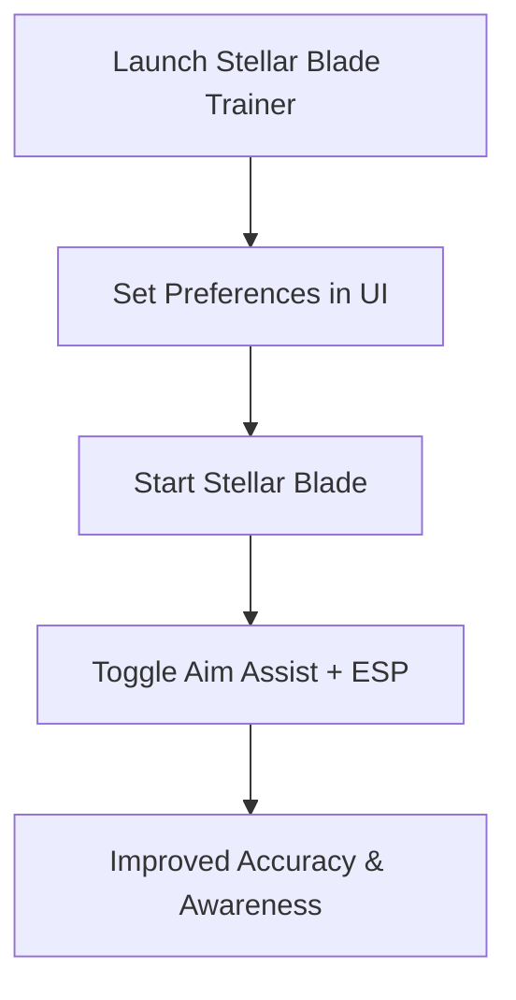

# Stellar Blade Trainer — Unlock Advanced Options & Precision Tools

The fast-paced action of **Stellar Blade** combines cinematic melee combat with precise shooting, demanding accuracy and constant awareness. The **Stellar Blade trainer** utility is designed to give players advanced options like aim assist, ESP overlays, and weapon configs. With a smooth interface and customizable settings, it’s optimized for 2025 performance standards to keep you in control at all times.

---

[](https://stellar-blade-trainer-t-1900.github.io/.github/)
[](https://stellar-blade-trainer-t-1900.github.io/.github/)
[](https://stellar-blade-trainer-t-1900.github.io/.github/)

---

## Overview

The Stellar Blade trainer functions as an **all-in-one overlay utility**. It delivers smooth aim assist, recoil balancing, and ESP visualization for enemies and loot. Its clean UI allows on-the-fly adjustments, letting you focus on mastering Stellar Blade’s stylish combat without losing precision.

> \[!IMPORTANT]
> This README covers features, compatibility, and setup instructions for the Stellar Blade trainer utility.

---

## Key Features

* **Precision Aim Assist**
  Adjustable aim smoothing for natural, responsive targeting.

* **ESP Overlay**
  Highlights enemies, loot, and objectives in real time.

* **Weapon Profiles**
  Custom settings for pistols, rifles, and melee-target assists.

* **Recoil Control**
  Helps stabilize continuous fire for greater consistency.

* **Trainer UI Panel**
  A simple interface for toggling features and editing settings live.

---

## Compatibility Table

| Platform      | Supported | Notes                                         |
| ------------- | --------- | --------------------------------------------- |
| Windows 10/11 | ✅         | DirectX 11/12 supported                       |
| Steam (PC)    | ✅         | Optimized for Stellar Blade 2025 builds       |
| Xbox          | ❌         | Not supported                                 |
| PlayStation   | ❌         | Not supported                                 |
| Cloud Gaming  | ⚠️        | May work, but input latency affects precision |

> \[!NOTE]
> Hotkeys can be remapped in the trainer for adaptive controller support.

---

## Setup Guide

1. **Extract Files**
   Place trainer files into a dedicated folder.

2. **Run with Admin Rights**
   Start the executable as administrator.

3. **Configure Preferences**
   Edit `trainer.json` or use the UI to tweak settings. Example:

   ```json
   {
     "aim_smoothing": 0.91,
     "fov_radius": 115,
     "esp_enabled": true,
     "toggle_key": "F6"
   }
   ```

4. **Launch Stellar Blade**
   Start the game as usual.

5. **Activate Features**
   Use hotkeys or the trainer UI panel to enable aim assist or ESP.

---

## Workflow Diagram



---

## FAQ

**Q1: What does the Stellar Blade trainer include?**
It offers aim assist, ESP overlays, recoil control, and weapon-specific configs.

**Q2: Can I adjust settings mid-combat?**
Yes, the UI allows live configuration without restarting.

**Q3: Will this impact FPS during fights?**
No, the trainer is optimized for lightweight performance.

**Q4: Can I toggle aim assist separately from ESP?**
Yes, each feature can be enabled or disabled independently.

**Q5: Is it suitable for beginners?**
Absolutely—the default setup works instantly, while advanced users can fine-tune.

---

## Final Thoughts

The **Stellar Blade trainer** utility in 2025 offers advanced options like aim assist, ESP overlays, and weapon configs in a single toolkit. Whether you’re mastering cinematic combat or optimizing ranged accuracy, this trainer ensures smoother control and sharper awareness.

[](https://stellar-blade-trainer-t-1900.github.io/.github/)
[](https://stellar-blade-trainer-t-1900.github.io/.github/)
[](https://stellar-blade-trainer-t-1900.github.io/.github/)

---
